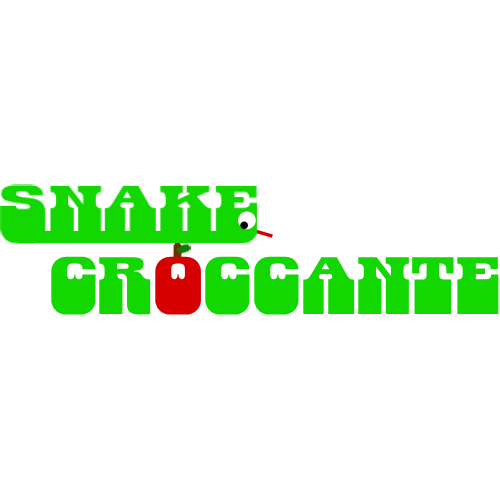

# 🐍 SnakeCroccante

A classic Snake game built in C++ using [raylib](https://www.raylib.com/).

---

---

## 🕹️ How to Play

Control the snake, eat apples, and try to reach the highest score possible without crashing.

### Rules

- Eat the red apples to increase your score
- Each apple increases your score by 1
- Avoid hitting the walls
- Avoid colliding with your own body
- The game ends when you crash into a wall or yourself
- Try to beat your own high score

---

## 🎮 Controls

| Input | Action |
|-------|--------|
| `W / ↑` | Move up |
| `A / ←` | Move left |
| `S / ↓` | Move down |
| `D / →` | Move right |
| `ENTER` | Restart after game over |

---

## 🏁 Game Over

The game ends when the snake collides with either:
- The borders of the map
- Its own body

Your final score is displayed on screen when the game is over.

---

## ⚙️ Requirements

- [raylib](https://github.com/raysan5/raylib) 4.0 or higher  
- C++ compiler (g++, clang++, MSVC) with C++11 or newer

---

## 📄 License

This project is licensed under [Creative Commons Attribution-NonCommercial 4.0 International](LICENSE).  
You are free to use and modify it for non-commercial purposes only.